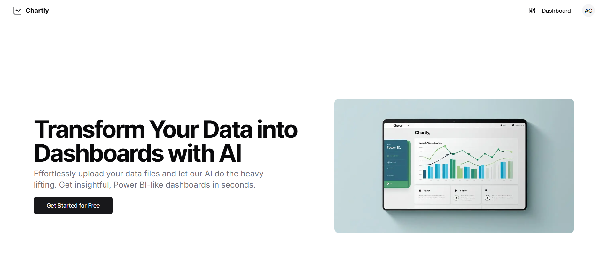
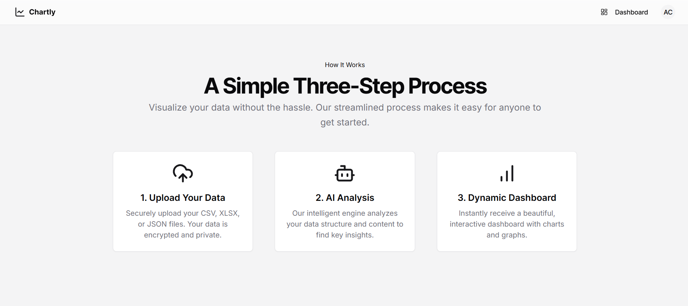
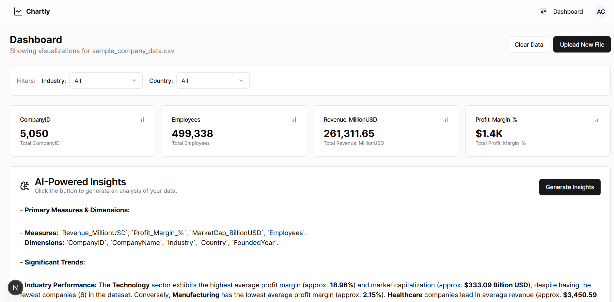
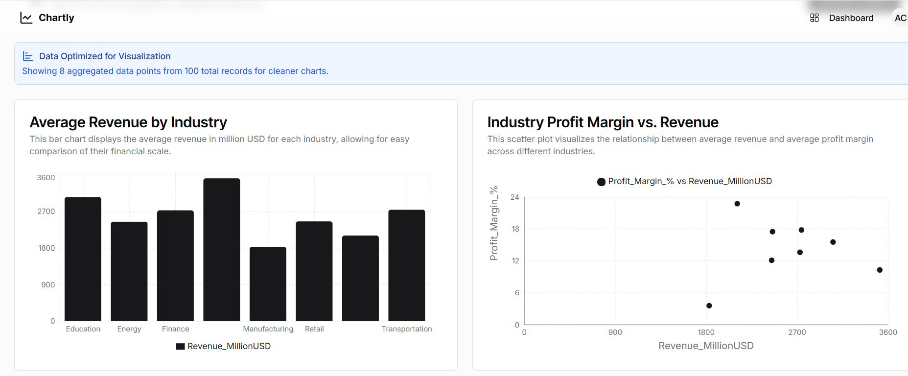
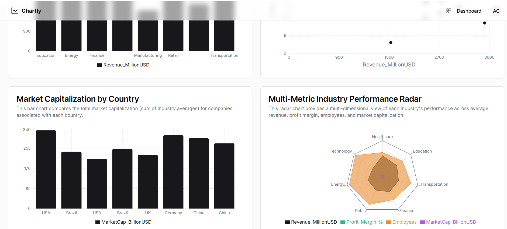

# 📊 Chartly - AI-Powered Data Visualization Platform

[](https://python.org)
[](https://fastapi.tiangolo.com/)
[](https://nextjs.org/)
[](https://firebase.google.com/)
[](LICENSE)

AI-powered data visualization platform that transforms raw data files into interactive, **Power BI-style dashboards** with intelligent chart recommendations and comprehensive insights — built with **FastAPI**, **Next.js**, and powered by **Google Gemini AI**.

---

## 🔗 Live Application

**Access the web app here**: [Live](https://chart-ly-frontend.vercel.app/)

---

## 📸 Screenshots

  
**Chartly Landing Page**

  
**Chartly Landing Page**

  
**Interactive Dashboard with AI-Generated Charts**

  
  
**AI-Powered Data Analysis and Insights**

---

## 📌 Features

### **🤖 AI-Powered Intelligence**
- **Smart Chart Recommendations** → Google Gemini AI analyzes data structure and suggests optimal visualizations
- **Automatic Data Insights** → Comprehensive textual analysis with trends, anomalies, and actionable business recommendations
- **Intelligent Data Optimization** → Automatically aggregates large datasets for cleaner, more readable charts

### **📈 Advanced Data Processing**
- **Multi-format Support** → Upload CSV, XLSX, and JSON files seamlessly
- **Robust Data Cleaning** → Handles missing values, type inference, and duplicate removal automatically
- **Smart Aggregation** → Time-based, categorical, and statistical sampling for optimal visualization
- **Real-time Processing** → Fast data transformation and chart generation

### **🎨 Interactive Dashboards**
- **Multiple Chart Types** → Line, bar, area, scatter, pie, and radar charts
- **Responsive Design** → Works seamlessly on desktop and mobile devices
- **Clean Visualizations** → Prevents overcrowded charts with intelligent data reduction
- **Export Capabilities** → Save charts and insights for presentations

### **🔐 Secure Authentication**
- **Firebase Authentication** → Secure user login and registration
- **Personal Dashboards** → Save and manage your data visualizations
- **Session Management** → Persistent user sessions across devices

---

## 🏗️ Tech Stack

### **Backend**
- **FastAPI** - High-performance async API framework
- **Google Gemini API** - AI-powered chart recommendations and insights
- **Pandas** - Advanced data manipulation and analysis
- **Python-dotenv** - Environment variable management

### **Frontend**
- **Next.js 13+** - React framework with App Router
- **TypeScript** - Type-safe development
- **Tailwind CSS** - Utility-first CSS framework
- **Recharts** - Interactive chart library
- **Firebase Auth** - Authentication and user management

### **Data Processing**
- **PyMuPDF** - PDF parsing capabilities
- **Scikit-learn** - Statistical processing
- **NumPy** - Numerical computations

---

## ⚙️ Installation

### **Backend Setup**

1. **Clone the repository:**
   ```bash
   git clone https://github.com/AdrshChaudhary/chart-ly.git
   cd chart-ly/backend
   ```

2. **Create and activate virtual environment:**
   ```bash
   python3 -m venv .venv
   source .venv/bin/activate   # On Windows: .venv\Scripts\activate
   ```

3. **Install dependencies:**
   ```bash
   pip install -r requirements.txt
   ```

4. **Create `.env` file:**
   ```env
   GEMINI_API_KEY=your_google_gemini_api_key_here
   ```

5. **Run the backend server:**
   ```bash
   python main.py
   ```
   Backend available at `http://localhost:8000`

### **Frontend Setup**

1. **Navigate to frontend directory:**
   ```bash
   cd ../frontend
   ```

2. **Install Node.js dependencies:**
   ```bash
   npm install
   ```

3. **Configure Firebase:**
   Create `.env.local` file:
   ```env
   NEXT_PUBLIC_FIREBASE_API_KEY=your_firebase_api_key
   NEXT_PUBLIC_FIREBASE_AUTH_DOMAIN=your_project.firebaseapp.com
   NEXT_PUBLIC_FIREBASE_PROJECT_ID=your_project_id
   NEXT_PUBLIC_API_URL=http://localhost:8000
   ```

4. **Start development server:**
   ```bash
   npm run dev
   ```
   Frontend available at `http://localhost:3000`

---

## 📡 API Endpoints

| Method | Endpoint | Description |
|--------|----------|-------------|
| `GET` | `/` | Health check |
| `POST` | `/api/charts/suggestions` | AI-powered chart recommendations with data optimization |
| `POST` | `/api/insights` | Comprehensive AI-generated data analysis |
| `POST` | `/api/data/optimize` | Intelligent data aggregation for cleaner visualizations |

---

## 📄 Example Request: Chart Suggestions

```bash
curl -X POST "http://localhost:8000/api/charts/suggestions" \
  -H "Content-Type: application/json" \
  -d '{
    "data": [
      {"date": "2023-01-01", "sales": 1500, "region": "North"},
      {"date": "2023-02-01", "sales": 1800, "region": "South"}
    ]
  }'
```

**Sample Response:**
```json
{
  "suggestions": [
    {
      "chartType": "line",
      "xAxis": "date",
      "yAxis": ["sales"],
      "title": "Sales Trend Over Time",
      "description": "Shows the progression of sales across the date range",
      "aggregated": true
    }
  ],
  "columnInfo": [
    {"name": "date", "type": "date"},
    {"name": "sales", "type": "numeric"},
    {"name": "region", "type": "categorical"}
  ],
  "processedData": [/* optimized dataset */],
  "originalRowCount": 10000,
  "processedRowCount": 45
}
```

---

## 🔍 Data Processing Pipeline

### **1. Data Ingestion**
- Accepts CSV, XLSX, and JSON file uploads through secure Firebase-authenticated interface
- Validates data structure and format before processing

### **2. Intelligent Data Cleaning**
- **Missing Values** → Mean for numeric columns, mode for categorical
- **Type Inference** → Automatic detection of numeric, date, and categorical columns
- **Duplicate Removal** → Eliminates redundant rows automatically
- **Column Filtering** → Removes columns with >60% missing data

### **3. Smart Aggregation**
- **Time-based Aggregation** → Monthly/weekly/daily based on date range
- **Categorical Grouping** → Groups by categories with statistical summaries
- **Statistical Sampling** → Stratified or random sampling for large datasets
- **Optimization Threshold** → Reduces to ~50 data points for optimal visualization

---

## 🤖 AI Integration with Google Gemini

### **Chart Generation Intelligence**
- Analyzes data structure and identifies optimal visualization patterns
- Recommends diverse, non-redundant chart types
- Considers data density and relationships for meaningful insights
- Generates contextual titles and descriptions

### **Data Insight Analysis**
- Identifies significant trends and quantifies changes
- Highlights anomalies and outliers in datasets
- Discovers key relationships between variables
- Delivers actionable business recommendations in Markdown format

---

## 🔐 Firebase Authentication Features

### **User Management**
- Secure email/password authentication
- Google OAuth integration
- Password reset functionality
- Email verification

### **Session Handling**
- Persistent login across browser sessions
- Secure token management
- Protected routes and API endpoints
- User profile management

---

## 🚀 Deployment

### **Backend Deployment (Railway/Heroku)**
```bash
# Install dependencies
pip install -r requirements.txt

# Set environment variables
export GEMINI_API_KEY=your_key_here

# Run production server
uvicorn main:app --host 0.0.0.0 --port $PORT
```

### **Frontend Deployment (Vercel)**
```bash
npm run build
npx vercel --prod
```

**Environment Variables for Production:**
- `NEXT_PUBLIC_FIREBASE_*` - Firebase configuration
- `NEXT_PUBLIC_API_URL` - Backend API URL
- `GEMINI_API_KEY` - Google Gemini API key (backend)

---

## 🧪 Development Notes

### **AI Prompt Engineering**
- Carefully crafted prompts for structured JSON outputs
- Error handling and retry logic for AI API calls
- Context-aware suggestions based on data characteristics

### **Performance Optimization**
- Async processing for non-blocking operations
- Intelligent caching for repeated operations
- Memory-efficient data handling for large datasets

### **Code Quality**
- TypeScript for type safety
- Comprehensive error handling
- Modular architecture for maintainability

---

## 🤝 Contributing

1. **Fork the repository**
2. **Create feature branch** (`git checkout -b feature/amazing-feature`)
3. **Commit changes** (`git commit -m 'Add amazing feature'`)
4. **Push to branch** (`git push origin feature/amazing-feature`)
5. **Open Pull Request**

### **Development Guidelines**
- Follow PEP 8 for Python code
- Use TypeScript for frontend development
- Add comprehensive error handling
- Update documentation for new features

---

## 🐛 Troubleshooting

### **Common Issues**

**Authentication Problems:**
- Verify Firebase configuration keys
- Check API endpoint URLs
- Ensure proper CORS settings

**AI API Failures:**
- Validate Gemini API key permissions
- Check API rate limits and quotas
- Review network connectivity

**Data Processing Errors:**
- Verify file format compatibility
- Check data structure requirements
- Review preprocessing pipeline logs

---

## 📜 License

MIT License - see [LICENSE](LICENSE) file for details.

---

## 🌟 Acknowledgements

- **Google Gemini AI** for powerful natural language processing
- **Firebase** for seamless authentication and user management
- **FastAPI** for the robust and fast backend framework
- **Next.js** for the excellent React-based frontend
- **Recharts** for beautiful and interactive chart components

---

## 👨‍💻 Author

**Aadarsh Chaudhary**  
- 🌐 [Portfolio](https://aadrsh.netlify.app/)  
- 💼 [LinkedIn](https://www.linkedin.com/in/aadarshchaudhary/)  
- 💻 [GitHub](https://github.com/AdrshChaudhary)

---

<div align="center">

**Built with ❤️**

[Live Demo](https://chart-ly-frontend.vercel.app/) • [Documentation](https://github.com/AdrshChaudhary/chart-ly) • [Report Issues](https://github.com/AdrshChaudhary/chart-ly/issues)

</div>
